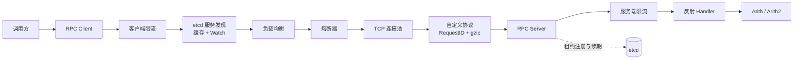

# T-RPC-Go


T-RPC-Go 是一个使用 Go 从零实现的轻量级 RPC 学习项目。项目没有使用 `net/rpc` 或 gRPC 作为业务通信层，而是自行实现了 TCP 传输、自定义消息帧、请求与响应关联、反射调用、服务注册与发现、负载均衡、限流和熔断等核心能力。

> 本项目用于学习和实验，与腾讯开源的 [tRPC-Go](https://github.com/trpc-group/trpc-go) 不是同一个项目，不建议直接用于生产环境。

## 功能特性

- 自定义 TCP RPC 协议，支持粘包、拆包和完整消息读取
- 基于 `RequestID` 关联异步请求与响应
- `Future` 异步调用，以及基于异步调用封装的同步接口
- 类似 `net/rpc` 的服务方法签名和反射调用
- 基于 etcd v3 的服务注册、租约续期、服务发现、本地缓存和 Watch
- 轮询、随机和平滑加权轮询负载均衡
- TCP 长连接复用和连接池
- 客户端与服务端令牌桶限流
- Closed、Open、Half-Open 三态熔断器
- JSON 编解码与 gzip 压缩
- 固定请求量和固定运行时长两种压测工具

## 调用架构



一次调用的大致流程如下：

1. 客户端从 etcd 获取目标服务的可用实例。
2. 负载均衡器选择一个实例，并检查该实例对应的熔断器状态。
3. 请求被序列化、gzip 压缩并写入复用的 TCP 连接。
4. 服务端解析消息，通过服务名和方法名反射调用业务方法。
5. 响应携带相同的 `RequestID` 返回，客户端读取协程将结果交给对应的 `Future`。

## 协议格式

每条消息使用大端字节序编码固定前缀，随后附加 JSON Header 和压缩后的 Body：

| 字段 | 长度 | 说明 |
| --- | ---: | --- |
| Magic | 2 字节 | 固定魔数 `0x1234` |
| Header Length | 4 字节 | JSON Header 的长度 |
| Body Length | 4 字节 | 传输 Body 的长度 |
| Header | 可变 | 包含请求 ID、服务名、方法名、错误和压缩类型 |
| Body | 可变 | RPC 请求或响应数据，当前调用链使用 JSON + gzip |

## 内置示例服务

业务方法采用以下签名：

```go
func (s *Service) Method(req *Request, reply *Response) error
```

项目内置两个算术服务：

| 服务 | 方法 | 参数 | 结果 |
| --- | --- | --- | --- |
| `Arith` | `Add` | `A`, `B` | `A + B` |
| `Arith` | `Mul` | `A`, `B` | `A * B` |
| `Arith2` | `Add` | `A`, `B`, `C` | `A + B + C` |
| `Arith2` | `Mul` | `A`, `B`, `C` | `A * B * C` |

两个示例服务端的职责如下：

| 程序 | 监听地址 | 注册服务 |
| --- | --- | --- |
| `cmd/server1` | `:9090` | `Arith`、`Arith2` |
| `cmd/server2` | `:9091` | `Arith` |

同时启动两个服务端后，客户端调用 `Arith` 时会从两个实例中选择节点；`Arith2` 只由 `server1` 提供。

## 项目结构

```text
.
├── cmd
│   ├── server1        # 9090：Arith + Arith2
│   ├── server2        # 9091：Arith
│   ├── client         # 周期性异步调用示例
│   ├── bench1         # 固定请求量压测
│   └── bench2         # 固定时长压测
├── internal
│   ├── breaker        # 三态熔断器
│   ├── client         # 同步/异步 RPC 客户端
│   ├── codec          # JSON、protobuf 原型与 gzip
│   ├── limiter        # 令牌桶限流
│   ├── loadbalance    # 轮询、随机、平滑加权轮询
│   ├── protocol       # 消息头与二进制帧
│   ├── registry       # etcd 注册、发现、缓存与 Watch
│   ├── server         # TCP Server 与反射 Handler
│   └── transport      # TCP 连接、连接池与 Future
├── pkg/api            # 示例请求、响应和业务服务
└── trpc.go            # 供其他 Go 项目使用的公共 API
```

## 作为 Go 库使用

其他项目不需要依赖 `internal` 目录，直接导入模块根包：

```go
import trpc "github.com/MAJinTao112/T-RPC-Go"

registry, err := trpc.NewRegistry([]string{"127.0.0.1:2379"})
if err != nil {
    return err
}
defer registry.Close()

client, err := trpc.NewClient(registry, trpc.WithClientTimeout(3*time.Second))
if err != nil {
    return err
}
defer client.Close()

err = client.Invoke(ctx, "UserService", "GetUserInfo", request, reply)
```

服务端通过 `trpc.NewServer` 创建，业务方法保持 `func(req *Request, reply *Response) error` 签名。

## 快速开始

### 1. 环境要求

- Go 1.25.4 或更高版本
- etcd v3，默认监听 `localhost:2379`
- 空闲端口 `9090`；若启动第二个实例，还需要端口 `9091`

克隆项目并下载依赖：

```bash
git clone https://github.com/MAJinTao112/T-RPC-Go.git
cd T-RPC-Go
go mod download
```

### 2. 启动 etcd

如果本机已经安装 etcd，可以直接运行：

```bash
etcd \
  --listen-client-urls=http://127.0.0.1:2379 \
  --advertise-client-urls=http://127.0.0.1:2379
```

也可以使用 Docker：

```bash
docker run --rm --name t-rpc-go-etcd \
  -p 2379:2379 \
  quay.io/coreos/etcd:v3.6.7 \
  /usr/local/bin/etcd \
  --listen-client-urls=http://0.0.0.0:2379 \
  --advertise-client-urls=http://127.0.0.1:2379
```

### 3. 启动服务端

新开一个终端，启动主服务端：

```bash
go run ./cmd/server1
```

如需体验 `Arith` 的多实例发现和负载均衡，再新开一个终端：

```bash
go run ./cmd/server2
```

服务注册在以下 etcd 前缀下：

```text
/T-RPC-Go/services/
```

每个实例使用 10 秒租约并持续 KeepAlive。示例中的 etcd 地址和服务广播地址均为 `localhost`；跨容器或跨机器运行时，需要修改服务端和客户端示例中的地址。

### 4. 启动客户端

```bash
go run ./cmd/client
```

客户端每 5 秒发起一轮请求，每轮异步发送 3 个 `Arith.Add` 调用，等待本轮请求全部完成后输出结果：

```text
====== 新一轮请求 ======
Add 0+0 result: 0
Add 1+1 result: 2
Add 2+2 result: 4
```

客户端会持续运行，可使用 `Ctrl+C` 结束进程。

## 默认容错参数

| 能力 | 默认值 |
| --- | --- |
| 客户端负载均衡 | 轮询 |
| 客户端超时配置 | 5 秒 |
| 客户端限流 | 每秒 10,000 个令牌 |
| 服务端限流 | 每秒 10,000 个令牌 |
| 熔断统计窗口 | 10 次调用 |
| 熔断失败率 | 大于或等于 60% |
| 熔断打开时间 | 5 秒 |
| 每个实例的连接池上限 | 1 条 TCP 连接 |
| 请求与响应压缩 | gzip |

## 性能测试

运行压测前，请先启动 etcd 和至少一个 `Arith` 服务端。

### 固定请求量

```bash
go run ./cmd/bench1 \
  -c 100 \
  -n 10000 \
  -b 100 \
  -etcd localhost:2379 \
  -s Arith \
  -m Add
```

| 参数 | 默认值 | 说明 |
| --- | ---: | --- |
| `-c` | `100` | 并发客户端数量 |
| `-n` | `10000` | 总请求数 |
| `-b` | `100` | 每批异步请求数 |
| `-etcd` | `localhost:2379` | etcd 地址 |
| `-s` | `Arith` | 服务名 |
| `-m` | `Add` | 方法名 |

输出包括成功数、失败数、总耗时、QPS 和成功请求的平均延迟。

### 固定运行时长

```bash
go run ./cmd/bench2 \
  -c 50 \
  -d 10 \
  -etcd localhost:2379 \
  -s Arith \
  -m Add
```

| 参数 | 默认值 | 说明 |
| --- | ---: | --- |
| `-c` | `50` | 并发客户端数量 |
| `-d` | `10` | 测试时长，单位为秒 |
| `-etcd` | `localhost:2379` | etcd 地址 |
| `-s` | `Arith` | 服务名 |
| `-m` | `Add` | 方法名 |

输出包括成功数、失败数、QPS、平均延迟以及 P50、P90、P99 延迟。

## 开发与检查

```bash
go test ./...
go vet ./...
go build ./...
```

目前仓库尚未包含 `*_test.go`，因此 `go test ./...` 主要用于编译检查。

## 当前限制

- 这是教学和原型项目，尚未实现鉴权、TLS、重试、链路追踪和完整可观测性。
- 服务端在一条 TCP 连接内串行处理请求，暂不支持流式 RPC。
- 当前可用的端到端链路固定使用 JSON 和 gzip；protobuf codec 已有原型，但尚未完整接入客户端、Future 和服务端 Handler。
- 示例程序中的 etcd 地址和服务地址为硬编码的 `localhost`。
- 异步调用尚未提供覆盖完整请求生命周期的统一超时控制。
- 示例服务端的优雅退出流程仍待完善。
- 当前没有自动化测试和 CI，进行较大改动时建议先补充协议、传输和并发相关测试。

## License

本项目使用 [GNU Affero General Public License v3.0](LICENSE) 许可证。
